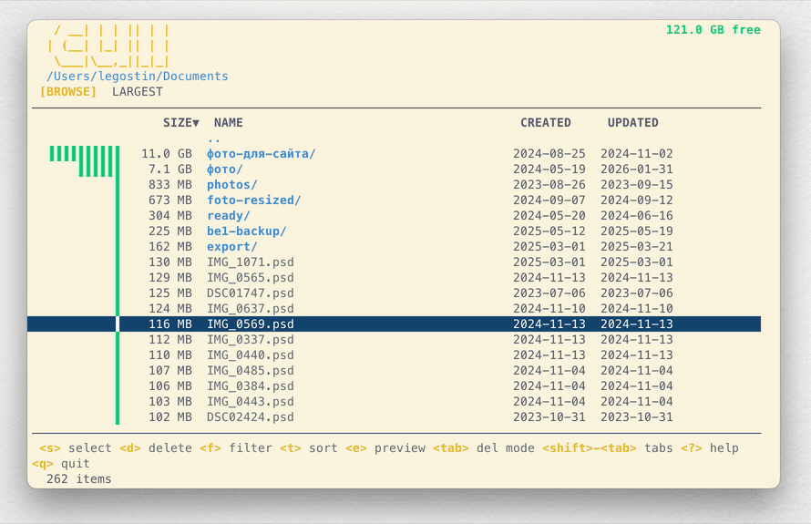
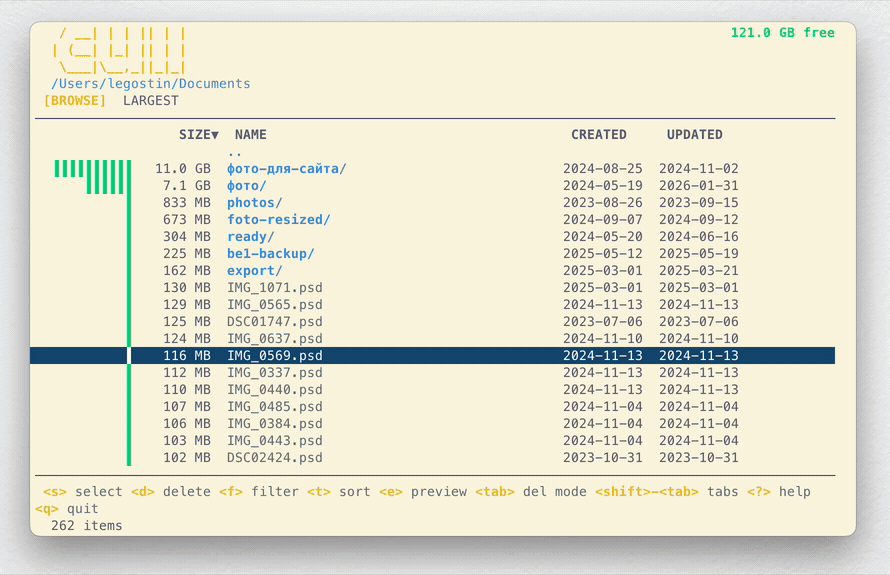
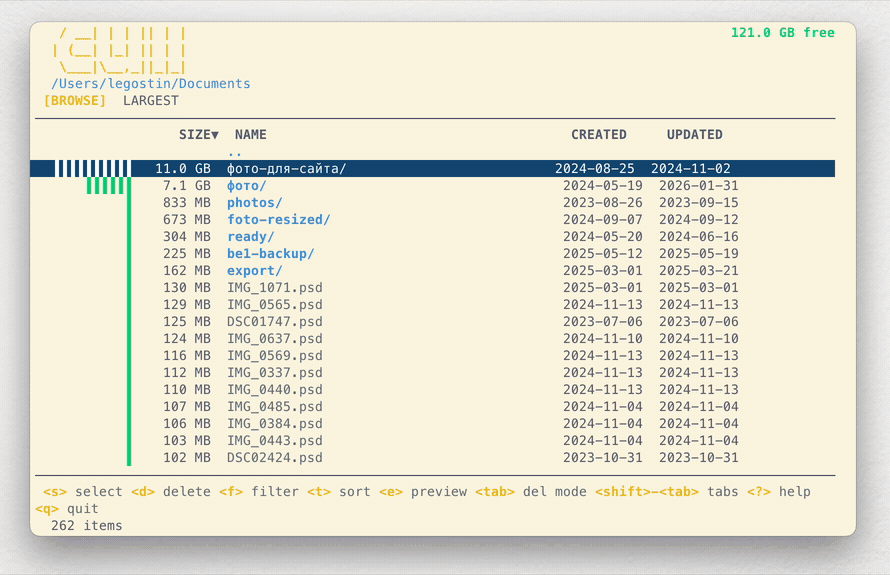
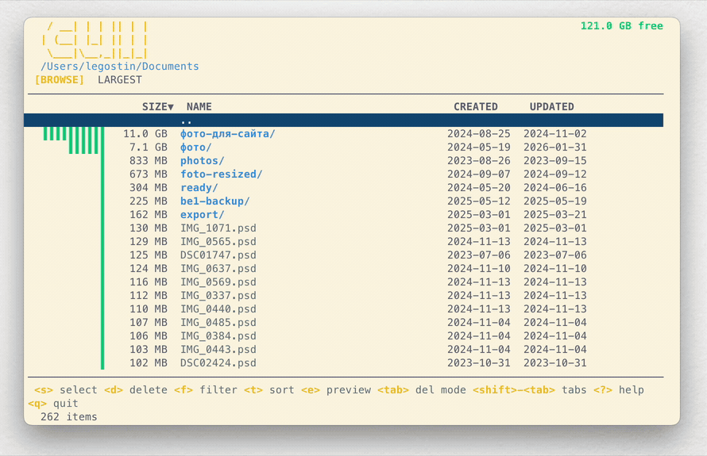

More my utilities on site [legost.in](https://legost.in/en/utilities)
# cull
```
              | | |
   / __| | | || | | 
  | (__| |_| || | | 
   \___|\__,_||_|_|
```
Interactive TUI disk space analyzer. Scan directories, find what's eating your disk, and delete it — all from the terminal.


## Install

### macOS

```
brew tap legostin/tap
brew install cull
```

### Linux (apt)

```
echo "deb [trusted=yes] https://legostin.github.io/apt-repo/ /" | sudo tee /etc/apt/sources.list.d/cull.list
sudo apt update
sudo apt install cull
```

### From source

```
go install github.com/legostin/cull@latest
```

## Usage

```
cull                        # scan current directory
cull ~/Downloads            # scan specific path
cull --read-only            # browse without deletion
cull -y                     # skip delete confirmation
cull -n 5000                # show up to 5000 items in Largest tab
```

## Features

### Browse and navigate

Instantly see what's taking up space. Directories are sized in the background while you browse — entries re-sort as sizes come in.


### Select and delete safely

Select files with `s`, range-select with `S`, then `d` to move to trash. Easy to undo.



### Permanent delete

Switch to permanent mode with `tab` when you're sure. Confirmation dialog keeps you safe.



### Find the largest files

`shift+tab` switches to the Largest tab — a deep scan across all subdirectories to surface the biggest files.



### Clear app caches safely

The CACHES tab finds known caches — dev tools (npm, go, cargo, Xcode…), browsers, messengers (Telegram, WhatsApp, Slack, Discord) and popular apps — and lets you trash or delete them. Docker is cleaned via `docker system prune -a -f` with confirmation.

### Reclaim build artifacts from old projects

The PROJECTS tab scans down from the launch path for project build artifacts — `node_modules`, Rust `target/`, Python `.venv`, Gradle `build/`, Go/PHP `vendor/`, CocoaPods, Terraform and more. Each row shows the artifact size and how long the project has been untouched; projects idle for 6+ months are highlighted green as safe to clean. Artifacts are matched only next to their project marker file (`package.json`, `Cargo.toml`, `go.mod`, …), so an unrelated `build/` directory is never touched.

### Filter by name

Press `f` and type to instantly filter entries. Great for finding files by extension.



## Keybindings

| Key | Action |
|-----|--------|
| `j` / `k` or arrow keys | Navigate up/down |
| `g` / `G` | Jump to top/bottom |
| `enter` | Enter directory |
| `backspace` / `esc` | Go to parent directory |
| `s` | Toggle selection |
| `S` | Range select |
| `d` | Delete selected |
| `e` | Dry-run preview |
| `f` | Filter by name |
| `h` | Toggle hidden files |
| `t` | Cycle sort mode (size / name / updated / created); size / idle on Projects |
| `r` | Rescan (Projects) / restore (History) |
| `tab` | Toggle trash / permanent delete |
| `shift+tab` | Switch tabs (Browse / Largest / Caches / History / Projects) |
| `space` | Quick Look preview (macOS) |
| `?` | Help |
| `q` / `ctrl+c` | Quit |

## License

MIT
