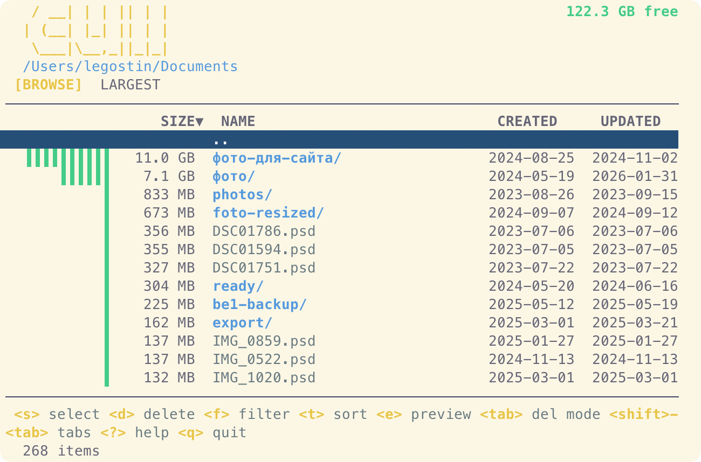

# cull

Interactive TUI disk space analyzer. Scan directories, find what's eating your disk, and delete it — all from the terminal.



## Install

```
brew tap legostin/tap
brew install cull
```

Or build from source:

```
go install github.com/legostin/cull@latest
```

## Usage

```
cull                        # scan current directory
cull ~/Downloads            # scan specific path
cull ~/Downloads ~/Desktop  # scan multiple roots
```

## Keybindings

| Key | Action |
|-----|--------|
| `j` / `k` or arrow keys | Navigate up/down |
| `g` / `G` | Jump to top/bottom |
| `enter` | Enter directory |
| `backspace` / `esc` | Go to parent directory |
| `s` | Toggle selection |
| `S` | Range select (from last selection to cursor) |
| `d` | Delete selected (or item under cursor) |
| `e` | Dry-run preview |
| `f` | Filter by name |
| `h` | Toggle hidden files |
| `t` | Cycle sort mode (size / name / updated / created) |
| `tab` | Toggle trash / permanent delete |
| `shift+tab` | Switch between Browse and Largest tabs |
| `space` | Quick Look preview (macOS) |
| `?` | Help |
| `q` / `ctrl+c` | Quit |

## How it works

1. **Quick scan** — instantly lists files and directories with file sizes
2. **Background sizing** — recursively computes directory sizes while you browse
3. **Deep scan** — finds the largest files across all subdirectories (Largest tab)
4. **Caching** — previously visited directories load instantly
5. **Live sorting** — entries re-sort by size as directory sizes are computed

## License

MIT
